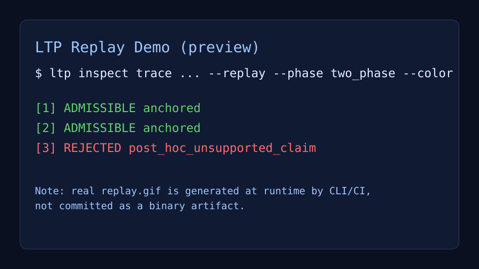
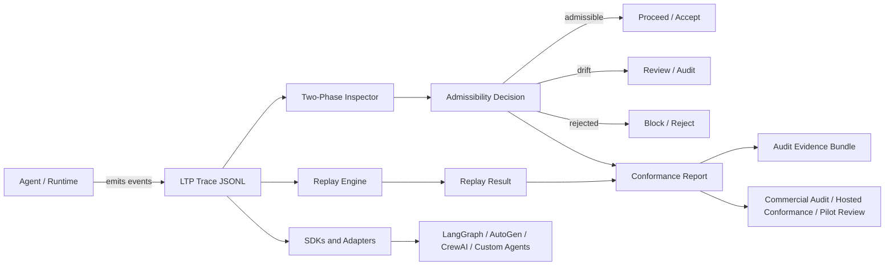

# LTP - Liminal Thread Protocol


## 10-second summary

AI agents can produce correct-looking outputs while hiding broken, drifting, or unsafe decision paths.

**LTP makes multi-step agent behavior replayable, inspectable, and auditable through deterministic traces and causal/log lineage.**

Use it to debug, evaluate, and monitor AI agents when the path matters as much as the final answer.

## Why it matters

- Deterministic replay of agent traces.
- Causal/log lineage for multi-step decisions.
- Inspection of unsupported, drifting, or unauditable execution paths.
- Audit-friendly evidence for AI safety, evals, monitoring, and compliance workflows.
- A practical surface for coding agents, long-horizon evals, AI-control research, and regulated agentic systems.

## Demo in 60 seconds

1. An agent emits an execution trace.
2. LTP replays the trace deterministically.
3. The inspector checks whether the execution path was admissible, drifting, or unsupported.
4. The result becomes auditable evidence, not just an output log.



LTP is a deterministic oversight and replay protocol for agent traces.
It helps teams inspect whether an AI or agent followed an admissible, grounded execution path, detect drift, reject unsupported outputs or actions, and preserve audit-grade evidence for high-risk workflows.

For reviewers navigating the broader ecosystem: LTP is the trace/replay/continuity layer in a broader trustworthy-agent evidence architecture. See the [Portfolio Reviewer Path](docs/PORTFOLIO_REVIEWER_PATH.md), the [Ecosystem Spider Map](docs/ECOSYSTEM_SPIDER_MAP.md), the [LS Grant Reviewer Packet 2026](https://github.com/safal207/LS/blob/main/docs/GRANT_REVIEWER_PACKET_2026.md), and the [ProofPath ecosystem graph](https://github.com/safal207/ProofPath/blob/main/docs/ECOSYSTEM_GRAPH.md).

<!-- community-interest:start -->
### 🌟 Community Interest


> Current interest: 4 stars → 🌱 New signal 🚀  
> Want to join? [Click here](https://github.com/safal207/L-THREAD-Liminal-Thread-Secure-Protocol-LTP-/stargazers) to show support!
<!-- community-interest:end -->

**Project status:** Active protocol and SDK development with multi-language CI checks.

**Production-readiness evidence:** The current capability matrix, exact non-claims and remaining v1.0 work are tracked in the generated [LTP Production Readiness Baseline](docs/production/READINESS_BASELINE.md) and epic #498.

**Fast validation (under 2 minutes):**

```bash
pnpm install --frozen-lockfile
pnpm test
```

## For grant reviewers

If you are evaluating LTP for a $20k-$50k AI safety / open-source infrastructure seed grant, start with:

- Portfolio reviewer path: `docs/PORTFOLIO_REVIEWER_PATH.md`
- Ecosystem spider map: `docs/ECOSYSTEM_SPIDER_MAP.md`
- Reviewer path: `docs/GRANT_REVIEWER_PATH.md`
- Seed grant proposal: `docs/GRANT_PROPOSAL_20K_50K.md`
- Benchmark plan: `docs/BENCHMARK_PLAN.md`
- Evaluation protocol: `docs/EVALUATION_PROTOCOL.md`
- Showcase trace map: `docs/SHOWCASE_TRACES.md`
- Repository map: `docs/REPO_MAP.md`
- Documentation status: `docs/DOCS_STATUS.md`
- Existing evidence and non-claims: `docs/GRANT_EVIDENCE.md`
- Grant brief: `GRANT_BRIEF.md`

## Why LTP exists

Modern agent systems can produce outputs that look plausible while following unsupported, drifting, or unauditable execution paths.
LTP exists to make those paths inspectable, replayable, and rejectable, with evidence that can be reviewed by operators, auditors, and compliance teams.

LTP is not a general-purpose runtime orchestrator. In v0.1, its practical identity is deterministic replay, execution-path inspection, admissibility judgment, and evidence export.

## Architecture at a glance



More detail: `docs/architecture/LTP-Architecture.md`

## What you get

- Deterministic replay-based inspection for agent execution traces.
- Oversight decisions on execution paths: `admissible / drift / rejected`.
- Two-phase oversight checks (pre-action/pre-generation and post-generation/post-action).
- Unsupported-path rejection within the oversight profile, including ungrounded or hallucinated claims.
