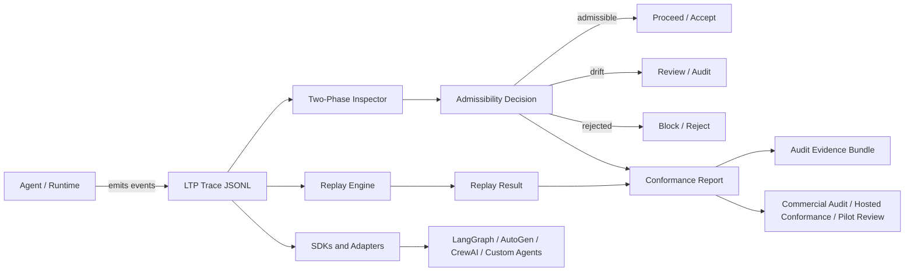

# LTP - Liminal Thread Protocol


LTP is a deterministic oversight and replay protocol for agent traces.
It helps teams inspect whether an AI or agent followed an admissible, grounded execution path, detect drift, reject unsupported outputs or actions, and preserve audit-grade evidence for high-risk workflows.

For reviewers navigating the broader ecosystem: LTP is the trace/replay/continuity layer; LS provides the broad grant reviewer packet; ProofPath / Compute Witness is the current executable evidence hub. See the [LS Grant Reviewer Packet 2026](https://github.com/safal207/LS/blob/main/docs/GRANT_REVIEWER_PACKET_2026.md) and the [ProofPath ecosystem graph](https://github.com/safal207/ProofPath/blob/main/docs/ECOSYSTEM_GRAPH.md).


<!-- community-interest:start -->
### 🌟 Community Interest


> Current interest: 3 stars → 🌱 New signal 🚀  
> Want to join? [Click here](https://github.com/safal207/L-THREAD-Liminal-Thread-Secure-Protocol-LTP-/stargazers) to show support!
<!-- community-interest:end -->

**Project status:** Active protocol and SDK development with multi-language CI checks.

**Fast validation (under 2 minutes):**

```bash
pnpm install --frozen-lockfile
pnpm test
```

## For grant reviewers

If you are evaluating LTP for a $20k-$50k AI safety / open-source infrastructure seed grant, start with:

- Reviewer path: `docs/GRANT_REVIEWER_PATH.md`
- Seed grant proposal: `docs/GRANT_PROPOSAL_20K_50K.md`
- Benchmark plan: `docs/BENCHMARK_PLAN.md`
- Evaluation protocol: `docs/EVALUATION_PROTOCOL.md`
- Showcase trace map: `docs/SHOWCASE_TRACES.md`
- Repository map: `docs/REPO_MAP.md`
- Documentation status: `docs/DOCS_STATUS.md`
- Existing evidence and non-claims: `docs/GRANT_EVIDENCE.md`
- Grant brief: `GRANT_BRIEF.md`

## Why LTP exists

Modern agent systems can produce outputs that look plausible while following unsupported, drifting, or unauditable execution paths.
LTP exists to make those paths inspectable, replayable, and rejectable, with evidence that can be reviewed by operators, auditors, and compliance teams.

LTP is not a general-purpose runtime orchestrator. In v0.1, its practical identity is deterministic replay, execution-path inspection, admissibility judgment, and evidence export.

## Architecture at a glance



More detail: `docs/architecture/LTP-Architecture.md`

## What you get

- Deterministic replay-based inspection for agent execution traces.
- Oversight decisions on execution paths: `admissible / drift / rejected`.
- Two-phase oversight checks (pre-action/pre-generation and post-generation/post-action).
- Unsupported-path rejection within the oversight profile, including ungrounded or hallucinated claims.
- Compliance evidence in JSONL traces and generated reports.
- Model/framework agnostic inspection surface.

## Oversight decisions and two-phase checks

LTP classifies execution paths, not just output quality:

- `admissible`: path is grounded/anchored and policy-safe.
- `drift`: path shows degraded context, weak grounding, or review-required deviation.
- `rejected`: path contains unsupported claims/actions or missing required anchors.

Two-phase checks:

1. Phase 1 (pre-action / pre-generation): fail the pre-check when reliable anchor context is missing.
2. Phase 2 (post-generation / post-action): inspect produced output/action traces and mark unsupported or fabricated claims/actions as `rejected`.

## LTP vs ordinary logging

| Capability | Regular app logs | Framework tracing | LTP |
|---|---|---|---|
| Deterministic replay | No | Partial | Yes |
| Execution-path admissibility decisions | No | Partial | Yes |
| Unsupported-path rejection | No | No | Yes |
| Audit-grade evidence export | Partial | Partial | Yes |
| Model/framework agnostic inspection surface | Yes | No | Yes |

## Core docs

- [Grant brief](./GRANT_BRIEF.md)
- [Whitepaper](./docs/WHITEPAPER_LTP_v0.1.md)
- [Adoption guide](./docs/LTP-Adoption-Guide.md)
- [Conformance docs](./docs/conformance/ci-consume-report.md)

## Why this matters

LTP is best described as a protocol-level trust layer:

- it keeps routing decisions replayable
- it keeps audit evidence inspectable
- it avoids coupling to a single framework or model provider
- it gives operators a deterministic way to verify what happened

## Use-case cards

### Fintech

- KYC/AML assistant actions with anchored policy checks.
- Transfer and approvals with unsupported paths rejected under the oversight profile.

### OSINT

- Evidence graph summaries marked `rejected` when source anchors are missing.
- Replay divergence analysis for investigative chain-of-custody.

### Legal

- Contract/policy citation enforcement.
- Post-hoc rejection of unsupported conclusions.

### Infra / SRE

- Incident-agent replay to inspect drift before automated actions.
- Critical runbook actions evaluated against anchor-backed context.

## Quick links

- Start here: `docs/START_HERE.md`
- Grant reviewer path: `docs/GRANT_REVIEWER_PATH.md`
- Seed grant proposal: `docs/GRANT_PROPOSAL_20K_50K.md`
- Benchmark plan: `docs/BENCHMARK_PLAN.md`
- Evaluation protocol: `docs/EVALUATION_PROTOCOL.md`
- Showcase trace map: `docs/SHOWCASE_TRACES.md`
- Repository map: `docs/REPO_MAP.md`
- Documentation status: `docs/DOCS_STATUS.md`
- Architecture: `docs/architecture/LTP-Architecture.md`
- LTP / CML bridge: `docs/architecture/LTP-CML-Bridge.md`
- Developer and commercial roadmap: `docs/roadmap/LTP-Developer-and-Commercial-Roadmap.md`
- Commercial pilot one-pager: `docs/commercial/LTP-Pilot-One-Pager.md`
- Audit report template: `docs/commercial/LTP-Audit-Report-Template.md`
- Grant evidence: `docs/GRANT_EVIDENCE.md`
- Related LS grant path: `docs/RELATED_LS_GRANT_PATH.md`
- DevTools: `docs/devtools/quickstart.md`
- Compliance: `docs/fintech/Compliance-Inspection.md`
- Adapters: `adapters/README.md`
- Example flow: `examples/README.canonical-flow.md`
- Spec: `specs/LTP-Spec-v0.1.md`

## Local validation

For a clean reviewer flow, first activate the repository pnpm version through Corepack:

```bash
corepack enable
corepack prepare pnpm@9.15.0 --activate
pnpm --version
```

Then run:

```bash
pnpm install --frozen-lockfile
pnpm test
pnpm test:conformance
```

The same command sequence is checked by `.github/workflows/quickstart-validation.yml`.

`pnpm test` is the curated reviewer-safe validation surface. If you want the broader legacy sweep as well, run `pnpm test:full`.

Local scratch directories such as `.tmp/` are ignored by the repository and excluded from TypeScript test discovery so golden snapshots stay deterministic.

## Positioning for grants

The strongest grant story is not "more features". It is better infrastructure for systems that need transparency, reproducibility, and interoperable evidence.

## Roadmap

- Done: Replay analyzer (`ltp inspect trace`)
- Done: Two-phase enforcement
- Done: GitHub Actions interactive demo
- Done: Community onboarding docs and contributor-ready backlog
- Done: Commercial pilot and audit templates
- In progress: Expanded adapter SDKs
- In progress: Rich replay animation renderer
- Planned: AutoGen v1.2 reference adapter
