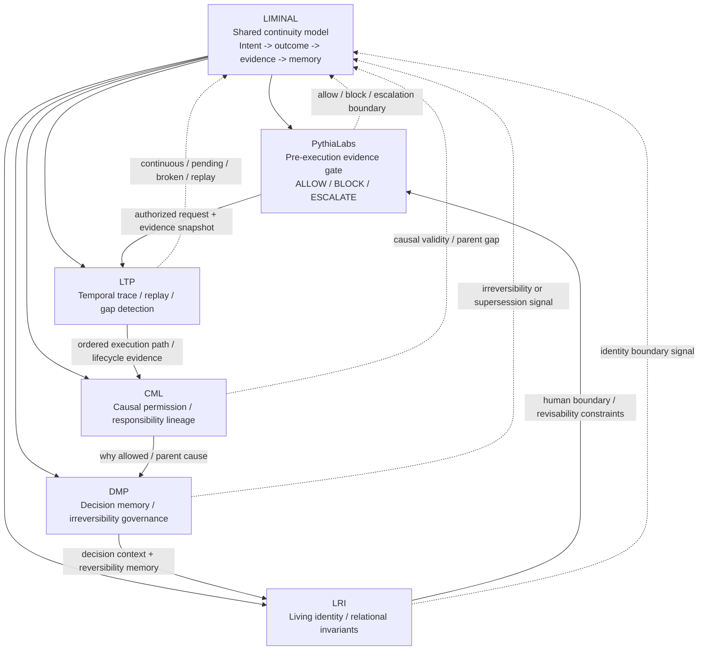

# Ecosystem Spider Map

Status: reviewer-facing portfolio map.

This document explains how the related repositories fit together as one continuity and evidence ecosystem rather than as separate ideas.

## Core thesis

The ecosystem is an open-source continuity and evidence architecture for trustworthy agentic systems.

It focuses on one narrow but important question:

```text
Can we preserve and inspect the connected chain from intent and request
through decision and execution to outcome, evidence, memory, and recovery?
```

The shared continuity invariant is:

```text
No orphan request.
No orphan response.
No silent gap.
```

A request may be validly `PENDING` or durably `DEFERRED`. The chain is broken when a request disappears without an observable state, an outcome has no known origin, or conflicting terminal outcomes claim the same logical request.

This invariant does not, by itself, prove that an external side effect happened exactly once, that a response is true, or that an action was authorized.

## Spider map



## Continuity spine

```text
Request / intent
        ↓
Permission or governance decision
        ↓
Observable execution state
        ↓
COMPLETED | FAILED | REJECTED | CANCELLED | TIMED_OUT
        ↓
Evidence and responsibility lineage
        ↓
Decision memory, recovery state, and the next request
```

A durable suspension remains connected when it preserves a continuation reference:

```text
PENDING -> DEFERRED -> RESUMED -> terminal outcome
```

The minimum broken-chain classes are:

```text
orphan request
orphan response
missing outcome
conflicting terminal outcomes
time reversal
missing causal parent
unrecognized replay
```

LTP is the technical temporal thread of this web: it records and evaluates the path, supports deterministic replay within its stated profile, and makes path gaps inspectable. Other repositories answer different questions around authorization, causal responsibility, decision memory, and human boundaries.

## One-line roles

| Repository | Role | Primary reviewer question |
|---|---|---|
| Liminal | Shared continuity lifecycle, vocabulary, and cross-layer invariants. | Does the observable history remain connected from intent to outcome, evidence, memory, and recovery? |
| PythiaLabs | Pre-execution evidence gate for high-risk agentic actions. | Should this proposed agent action be allowed, blocked, or escalated before the tool call? |
| LTP | Temporal path trace, replay, gap detection, and admissibility protocol. | Was the execution path continuous, grounded, replayable, and admissible within the supported profile? |
| CML | Causal permission and responsibility lineage layer. | Why was this action allowed, and is the causal parent/responsibility chain intact? |
| DMP | Decision memory and irreversibility governance layer. | What was decided, why, and did later reality make the decision irreversible? |
| LRI | Living identity and relational invariant layer. | Does the system preserve human revisability, relational context, and identity boundaries? |

## Layered flow

```text
Liminal defines the shared lifecycle and continuity invariants
        ↓
AI agent proposes a high-risk action
        ↓
PythiaLabs checks evidence, authorization, context, recovery, and risk
        ↓
ALLOW / BLOCK / ESCALATE
        ↓
LTP records and evaluates the temporal path and request/outcome continuity
        ↓
CML checks causal permission and responsibility lineage
        ↓
DMP preserves decision context, reversibility assumptions, and outcome drift
        ↓
LRI preserves human identity/revisability boundaries and relational authority
        ↓
The resulting evidence and memory can ground the next request
```

## Why these are separate repositories

The repositories are separate because each layer protects a different failure surface.

| Failure surface | Repository |
|---|---|
| The ecosystem lacks a shared lifecycle connecting intent, execution, outcome, evidence, and recovery. | Liminal |
| Agent reaches a dangerous tool call without enough evidence. | PythiaLabs |
| Final output looks plausible, but the temporal path is missing, unsupported, drifting, or internally conflicting. | LTP |
| Action succeeded operationally, but the causal permission chain is broken. | CML |
| Decision was recorded, but reversibility and later consequences were lost. | DMP |
| System optimizes or freezes human identity instead of preserving revisability. | LRI |

## Repository links

- Liminal: `https://github.com/safal207/Liminal`
- Liminal Continuity Web v0.1: `https://github.com/safal207/Liminal/blob/main/docs/architecture/LIMINAL_CONTINUITY_WEB_V0_1.md`
- PythiaLabs: `https://github.com/safal207/pythiaLabs`
- LTP: `https://github.com/safal207/L-THREAD-Liminal-Thread-Secure-Protocol-LTP-`
- CML: `https://github.com/safal207/Causal-Memory-Layer`
- DMP: `https://github.com/safal207/DMP-decision-memory-protocol`
- LRI: `https://github.com/safal207/Living-Relational-Identity-LRI`

## Reviewer interpretation

A reviewer should not read these repositories as unrelated prototypes.

They should be read as one continuity web:

```text
Liminal defines what must remain connected.
PythiaLabs decides whether an action should proceed.
LTP preserves and evaluates the temporal path that produced the action and outcome.
CML checks why the action was causally permitted.
DMP remembers the decision and its reversibility assumptions.
LRI protects human identity and revisability boundaries.
```

## How this supports funding review

For a grantmaker, the ecosystem has a clean staged interpretation:

1. **Shared architecture:** Liminal continuity lifecycle and invariants.
2. **Near-term executable evidence:** LTP and PythiaLabs.
3. **Causal audit depth:** CML.
4. **Governance memory depth:** DMP.
5. **Human boundary / identity governance depth:** LRI.

This means the portfolio can support both narrow technical funding and broader safety/governance research while keeping each repository's claim boundary explicit.

## Evidence maturity by layer

| Layer | Current maturity | Funding/reviewer use |
|---|---|---|
| Liminal | Public umbrella architecture and continuity model; not the primary executable evidence package. | Shared vocabulary and cross-repository reviewer path. |
| LTP | Strongest current evidence package; 115-case deterministic benchmark and v0.2 evidence release. | Main anchor for $100k+ evidence-ready review. |
| PythiaLabs | Strong applied demo/product framing with deterministic action-gate demos and reviewer docs. | Applied product/research bridge for agent action safety. |
| CML | Strong causal audit framing with validation/docs and open hardening tasks. | Second technical anchor after LTP. |
| DMP | Conceptual/spec artifact for governance memory and irreversibility. | Governance-memory extension layer. |
| LRI | Identity/revisability governance artifact with schemas/reference implementation. | Human-boundary and relational-safety extension layer. |

## Claim boundaries

This ecosystem does not claim:

- full AI alignment;
- certified compliance;
- production security certification;
- universal prevention of unsafe actions;
- universal model evaluation;
- automated identity classification;
- replacement of human governance;
- replacement of security, legal, or compliance teams;
- that continuity alone proves a response is true or correct;
- that trace continuity alone proves an external side effect occurred;
- universal exactly-once execution across external systems.

The narrower claim is:

```text
These repositories define an early open-source continuity and evidence architecture
for making high-risk agentic behavior more connected, inspectable, replayable,
causally reviewable, and governance-aware.
```

## Recommended reading order

For OpenAI / funding reviewers:

1. Liminal continuity web: `Liminal/docs/architecture/LIMINAL_CONTINUITY_WEB_V0_1.md`
2. Liminal agent continuity model: `Liminal/docs/architecture/LIMINAL_AGENT_CONTINUITY_MODEL_V0_1.md`
3. LTP technical report: `docs/TECHNICAL_REPORT_DRAFT.md`
4. LTP benchmark results: `benchmark/RESULTS.md`
5. PythiaLabs one-page summary: `pythiaLabs/docs/PYTHIALABS_ONE_PAGE_SUMMARY.md`
6. CML README and grant evidence.
7. DMP README and validation results.
8. LRI README and security/trust model.

## Portfolio hardening issues

Current hardening trackers:

- CML: `https://github.com/safal207/Causal-Memory-Layer/issues/85`
- DMP: `https://github.com/safal207/DMP-decision-memory-protocol/issues/12`
- LRI: `https://github.com/safal207/Living-Relational-Identity-LRI/issues/38`
- PythiaLabs: `https://github.com/safal207/pythiaLabs/issues/189`
