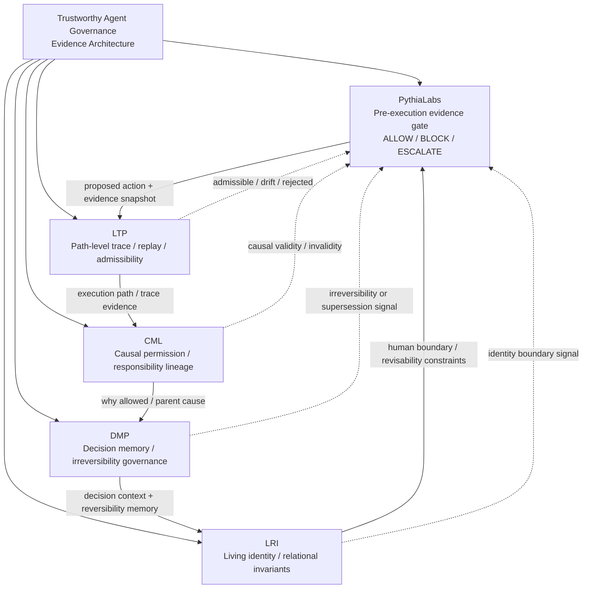

# Ecosystem Spider Map

Status: reviewer-facing portfolio map.

This document explains how the related repositories fit together as one ecosystem rather than as separate ideas.

## Core thesis

The ecosystem is an open-source evidence architecture for trustworthy agentic systems.

It focuses on one narrow but important question:

```text
Can we inspect, justify, remember, and bound high-risk agent behavior before it becomes unreviewable?
```

## Spider map



## One-line roles

| Repository | Role | Primary reviewer question |
|---|---|---|
| PythiaLabs | Pre-execution evidence gate for high-risk agentic actions. | Should this proposed agent action be allowed, blocked, or escalated before the tool call? |
| LTP | Path-level trace, replay, and admissibility protocol. | Was the execution path grounded, replayable, and admissible? |
| CML | Causal permission and responsibility lineage layer. | Why was this action allowed, and is the causal parent/responsibility chain intact? |
| DMP | Decision memory and irreversibility governance layer. | What was decided, why, and did later reality make the decision irreversible? |
| LRI | Living identity and relational invariant layer. | Does the system preserve human revisability, relational context, and identity boundaries? |

## Layered flow

```text
AI agent proposes high-risk action
        ↓
PythiaLabs checks evidence, authorization, context, recovery, and risk
        ↓
ALLOW / BLOCK / ESCALATE
        ↓
LTP records and evaluates the path-level trace
        ↓
CML checks causal permission and responsibility lineage
        ↓
DMP preserves decision context, reversibility assumptions, and outcome drift
        ↓
LRI preserves human identity/revisability boundaries and relational authority
```

## Why these are separate repositories

The repositories are separate because each layer protects a different failure surface.

| Failure surface | Repository |
|---|---|
| Agent reaches a dangerous tool call without enough evidence. | PythiaLabs |
| Final output looks plausible, but the path was unsupported or drifting. | LTP |
| Action succeeded operationally, but the causal permission chain is broken. | CML |
| Decision was recorded, but reversibility and later consequences were lost. | DMP |
| System optimizes or freezes human identity instead of preserving revisability. | LRI |

## Repository links

- PythiaLabs: `https://github.com/safal207/pythiaLabs`
- LTP: `https://github.com/safal207/L-THREAD-Liminal-Thread-Secure-Protocol-LTP-`
- CML: `https://github.com/safal207/Causal-Memory-Layer`
- DMP: `https://github.com/safal207/DMP-decision-memory-protocol`
- LRI: `https://github.com/safal207/Living-Relational-Identity-LRI`

## Reviewer interpretation

A reviewer should not read these repositories as five unrelated prototypes.

They should be read as an ecosystem:

```text
PythiaLabs decides whether an action should proceed.
LTP preserves and evaluates the path that produced the action.
CML checks why the action was causally permitted.
DMP remembers the decision and its reversibility assumptions.
LRI protects human identity and revisability boundaries.
```

## How this supports funding review

For a grantmaker, the ecosystem has a clean staged interpretation:

1. **Near-term executable evidence**: LTP and PythiaLabs.
2. **Causal audit depth**: CML.
3. **Governance memory depth**: DMP.
4. **Human boundary / identity governance depth**: LRI.

This means the portfolio can support both narrow technical funding and broader safety/governance research.

## Evidence maturity by layer

| Layer | Current maturity | Funding/reviewer use |
|---|---|---|
| LTP | Strongest current evidence package; 115-case deterministic benchmark and v0.2 evidence release. | Main anchor for $100k+ evidence-ready review. |
| PythiaLabs | Strong applied demo/product framing with deterministic action-gate demos and reviewer docs. | Applied product/research bridge for agent action safety. |
| CML | Strong causal audit framing with validation/docs and open hardening tasks. | Second technical anchor after LTP. |
| DMP | Conceptual/spec artifact for governance memory and irreversibility. | Governance-memory extension layer. |
| LRI | Identity/revisability governance artifact with schemas/reference implementation. | Human-boundary and relational-safety extension layer. |

## Non-claims

This ecosystem does not claim:

- full AI alignment;
- certified compliance;
- production security certification;
- universal prevention of unsafe actions;
- universal model evaluation;
- automated identity classification;
- replacement of human governance;
- replacement of security, legal, or compliance teams.

The narrower claim is:

```text
These repositories define an early open-source evidence architecture for making high-risk agentic behavior more inspectable, replayable, causally reviewable, and governance-aware.
```

## Recommended reading order

For OpenAI / funding reviewers:

1. LTP technical report: `docs/TECHNICAL_REPORT_DRAFT.md`
2. LTP benchmark results: `benchmark/RESULTS.md`
3. PythiaLabs one-page summary: `pythiaLabs/docs/PYTHIALABS_ONE_PAGE_SUMMARY.md`
4. CML README and grant evidence.
5. DMP README and validation results.
6. LRI README and security/trust model.

## Portfolio hardening issues

Current hardening trackers:

- CML: `https://github.com/safal207/Causal-Memory-Layer/issues/85`
- DMP: `https://github.com/safal207/DMP-decision-memory-protocol/issues/12`
- LRI: `https://github.com/safal207/Living-Relational-Identity-LRI/issues/38`
- PythiaLabs: `https://github.com/safal207/pythiaLabs/issues/189`
