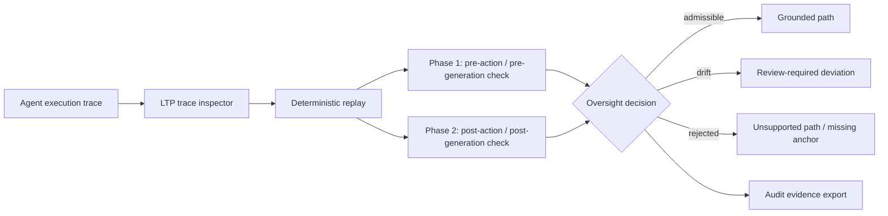

# Grant Evidence Package

Status: reviewer-facing evidence package.

Scope: this document summarizes the current Liminal Thread Protocol (LTP) artifact, reproducible reviewer path, evidence assets, explicit non-claims, and near-term research roadmap for grant reviewers.

## One-sentence claim

LTP is an open-source deterministic oversight and replay protocol for agent traces: it helps reviewers inspect whether an AI-agent execution path was anchored, admissible, replayable, and rejectable when unsupported claims or actions appear.

## Core idea

LTP evaluates execution paths, not just final outputs.

```text
agent trace -> deterministic replay -> two-phase inspection -> admissible / drift / rejected -> evidence artifact
```

## Reviewer path

A reviewer can validate the current artifact locally with the curated validation surface:

```bash
pnpm install --frozen-lockfile
pnpm test
pnpm test:conformance
```

A reviewer can also inspect a trace directly:

```bash
ltp inspect trace tools/ltp-inspect/fixtures/replay/trace-replay.jsonl --replay --phase two_phase --color
```

The broader legacy sweep is available via:

```bash
pnpm test:full
```

## Architecture at a glance



LTP is not a runtime orchestrator. Its practical identity is deterministic replay, execution-path inspection, admissibility judgment, and evidence export.

## Current evidence matrix

| Evidence asset | Reviewer question | Path / command | Current status |
| --- | --- | --- | --- |
| Curated test surface | Can the repository validate core behavior deterministically? | `pnpm test` | Implemented |
| Conformance tests | Do protocol-facing checks run consistently? | `pnpm test:conformance` | Implemented |
| Trace replay fixture | Can a reviewer inspect a trace with replay mode? | `tools/ltp-inspect/fixtures/replay/trace-replay.jsonl` | Implemented |
| Two-phase inspection | Can LTP distinguish pre-check failure from post-output unsupported claims/actions? | `ltp inspect trace --phase two_phase` | Implemented |
| DevTools quickstart | Is there a reviewer/devtools path? | `docs/devtools/quickstart.md` | Documented |
| Compliance inspection | Is there a fintech/compliance-oriented example? | `docs/fintech/Compliance-Inspection.md` | Documented |
| Adapters surface | Is there a model/framework integration path? | `adapters/README.md` | Documented / roadmap |
| Spec | Is the protocol boundary documented? | `specs/LTP-Spec-v0.1.md` | Documented |
| Live demo workflow | Can GitHub Actions produce replay artifacts? | `.github/workflows/demo.yml` | Implemented workflow |

## What is already implemented

- Deterministic replay-based trace inspection.
- `ltp inspect trace` CLI surface.
- Two-phase oversight modes.
- Execution-path decisions: `admissible`, `drift`, `rejected`.
- Unsupported-path rejection under an oversight profile.
- JSONL trace fixtures and replay examples.
- GitHub Actions demo producing replay artifacts.
- Conformance validation and curated reviewer-safe test command.
- Model/framework-agnostic positioning and adapter roadmap.
- Security hardening work, including removal of unnecessary UUID dependency in favor of native crypto UUID generation.

## What LTP detects or makes inspectable

LTP is designed to inspect failure classes such as:

- missing required anchors,
- unsupported claims or actions,
- execution-path drift,
- weak or degraded grounding,
- rejected branches that should not be used as support,
- inadmissible transitions under an oversight profile,
- replay divergence between expected and observed path semantics.

## What this project does not claim yet

LTP currently does not claim:

- full AI alignment,
- complete prevention of unsafe actions,
- production runtime orchestration,
- replacement of agent frameworks,
- replacement of logging or observability systems,
- certified compliance,
- production security enforcement by itself,
- universal semantic truth validation.

The current value is narrower: deterministic replay and oversight inspection for agent execution traces.

## Why this is grant-relevant

Advanced AI-agent systems increasingly take multi-step actions. Final output review can miss unsupported execution paths, missing anchors, and post-hoc hallucinated justifications.

LTP contributes one testable safety primitive:

```text
trace -> replay -> admissibility / drift / rejection -> audit evidence
```

This makes path-level failures reproducible and easier to evaluate than narrative-only review.

## Research / build roadmap

Near-term grant-funded work can focus on:

1. **Trace schema hardening** — standardize event fields, anchors, phases, decision codes, and evidence exports.
2. **Replay fidelity metrics** — measure whether execution-path decisions remain stable across reruns and environments.
3. **Two-phase semantic enforcement** — expand pre/post checks for unsupported claims and actions.
4. **Adapter SDKs** — improve integration with agent frameworks and MCP-style tool surfaces.
5. **Benchmark corpus** — publish trace fixtures for coding agents, browsing agents, financial workflows, and infra/SRE actions.
6. **Inspector artifacts** — produce reviewer-friendly HTML/Markdown reports and replay animations.
7. **Comparative evaluation** — compare LTP against unstructured logs, framework tracing, prompt-only guardrails, and after-the-fact monitoring.

## Relationship to CML and PythiaLabs

LTP answers a different question from CML and PythiaLabs:

- **LTP:** Was this agent execution path inspectable, replayable, anchored, and admissible?
- **CML:** Was this action causally valid under authorization, intent, and responsibility lineage?
- **PythiaLabs:** Should this proposed high-risk agent action be allowed, blocked, or escalated before tools are called?

Together they form complementary layers, but LTP is useful independently as a deterministic trace replay and oversight-inspection protocol.

## Suggested grant reviewer checklist

A reviewer can ask:

- Can I run the curated validation path locally?
- Can I inspect a trace and reproduce a replay decision?
- Does the project distinguish path admissibility from final output plausibility?
- Are unsupported paths rejectable?
- Are non-claims explicit?
- Is there a plausible path from current CLI/demo to benchmarkable research infrastructure?

## Current strongest positioning

Use this formulation in applications:

```text
LTP is an open-source deterministic oversight and replay protocol for agent traces. It evaluates whether agent execution paths are anchored, admissible, replayable, and rejectable when unsupported claims or actions appear.
```
