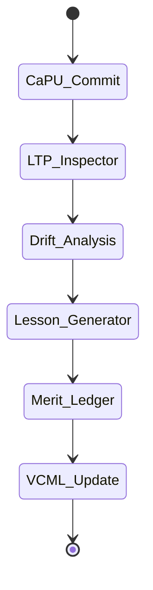
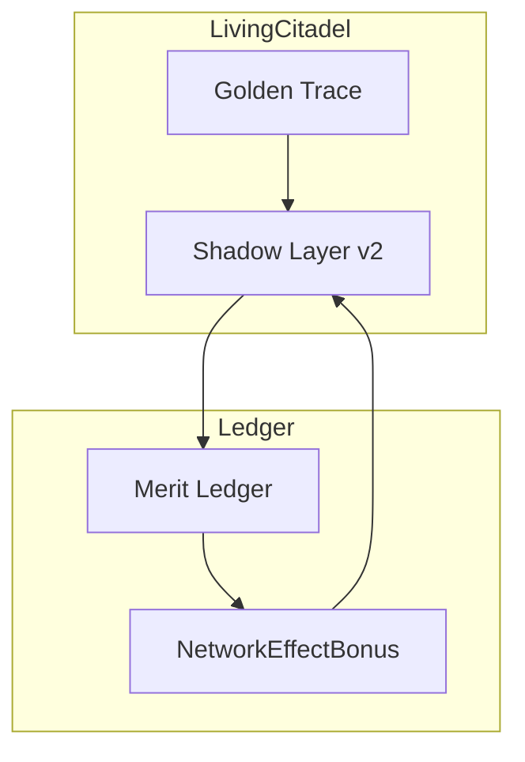
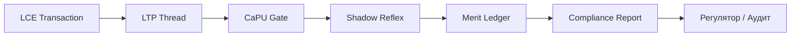

# ТЗ-3.0: Shadow Layer v2 + Merit Ledger Consensus в Living Citadel

## Changelog
| Версия | Дата       | Изменения |
|--------|------------|-----------|
| 3.0    | 20.02.2026 | Полная интеграция Shadow Layer v2 + Merit Ledger как рефлексивно-экономического слоя Living Citadel |
| 2.6    | 20.02.2026 | Living Citadel + L-THREAD LTP |

## Метаданные
- **Проект:** Укрепление фундамента памяти Hexagon Core
- **Стадия:** ТЗ-2.6 → ТЗ-3.0 «Shadow Layer v2 + Merit Ledger»
- **Версия:** 3.0
- **Дата:** 20 февраля 2026
- **Автор:** Главный Архитектор
- **Статус:** Production-ready к передаче в Codex Agent

## Glossary
- **Shadow Layer v2** — рефлексивный слой, анализирующий golden traces, drift и interventions в реальном времени
- **Merit Ledger** — распределённая экономика ответственности (NetworkEffectBonus, responsibility_id)
- **Reflexive Consensus** — автоматическое формирование уроков и начисление merit-points после каждого Commit

## Цель
Создать **рефлексивно-экономический слой** Living Citadel, который:
- превращает каждый LTP-thread в осмысленный опыт;
- автоматически генерирует и применяет lessons из VCML;
- начисляет/списывает merit-points через Merit Ledger Consensus;
- делает агента экономически мотивированным к качественным решениям.

Ожидаемые эффекты:
- ускорение рефлексии ≥ 65 %;
- снижение «слепых» решений ≥ 60 %;
- Merit Ledger convergence за ≤ 3 итерации;
- готовность к Fintech-регуляторным сценариям (полная traceability + экономическая ответственность).

## Архитектурные принципы (обязательные)
1. **Reflexive-first** — Shadow Layer работает сразу после каждого CaPU Commit.
2. **Merit-driven** — каждое решение влияет на NetworkEffectBonus агента и сети.
3. **Golden-Trace-driven** — анализ только через детерминированные LTP-traces.
4. **Coherence + Drift-aware** — рефлексия учитывает LSS coherence и L-THREAD drift.
5. **Zero-downtime + ACID + Thread-safety**.

## Исходные материалы
- ТЗ-2.6 (Living Citadel + L-THREAD)
- `docs/MERIT_LEDGER_CONSENSUS.md` и `docs/BOOTSTRAPPING_MECHANISM.md`
- `docs/LCE_IN_LS.md`
- <https://github.com/safal207/L-THREAD-Liminal-Thread-Secure-Protocol-LTP->
- <https://github.com/safal207/Liminal-Presence-Interface-LPI>
- <https://github.com/safal207/LRE-Core/releases/tag/v1.0.0>
- <https://github.com/safal207/CaPU>
- <https://github.com/safal207/Causal-Memory-Layer/tree/main/vcml>

## Требования к реализации

### 1) Новый модуль Shadow Layer v2
Создать пакет: `python/modules/hexagon_core/shadow_layer_v2/`.
Ключевой класс: `ShadowReflexEngine` — оркестратор анализа golden traces + Merit Ledger.

### 2) Рефлексия по Golden Trace
После каждого CaPU Commit:
- LTP Inspector → анализ drift, coherence, admissible branches;
- Автоматическая генерация lessons → конвертация в VCML permission rules;
- Начисление merit-points по формуле: `merit_delta = success_score × (1 - drift) × NetworkEffectBonus`.

### 3) Merit Ledger Consensus
- Полная интеграция с существующим Merit Ledger (Bootstrapping Mechanism);
- Каждый агент имеет ledger-score;
- Consensus на уровне сети: при drift < 0.15 → +bonus всем участникам thread;
- Fintech-режим: responsibility_id привязан к юридическому лицу/роли.

### 4) Интеграция с Living Citadel
- Shadow Layer получает: LTP golden trace, LSS interventions, VCML records;
- Выдаёт: новые permission rules для CaPU, updated merit-score, suggestInterventions для LSS.

### 5) Fintech-специфичные фичи
- Compliance Report Generator (`/audit?thread_id=ltp-...`);
- Regulatory Export (PDF + JSON с Mermaid-схемой пути);
- KYC/AML long-horizon memory (TTL 7 лет cold storage).

## Non-functional требования
- Latency рефлексии < 45 мс (p95);
- Падение производительности Core ≤ 2.5 %;
- Merit Ledger throughput ≥ 5000 операций/сек;
- Полная deterministic replay + compliance_report.json.

## Тестовое покрытие
- 32+ unit-тестов (drift analysis, merit calculation, lesson generation);
- 8 интеграционных сценариев (включая Fintech KYC + AML Sweep + Regulatory Export);
- Coverage ≥ 97 % для `shadow_layer_v2`;
- CI: `merit_ledger_consensus_test` + `ltp inspect --golden`.

## Acceptance Criteria
- [ ] Полный рефлексивный цикл (Golden Trace → Lesson → Merit Update) для каждой trajectory.
- [ ] Reflexive relevance ≥ 0.85 на 3 реальных сценариях из docs/ (включая Fintech).
- [ ] Снижение «слепых» решений ≥ 60 %.
- [ ] Merit Ledger convergence за ≤ 3 итерации.
- [ ] Shadow Layer использует drift + coherence в 100 % случаев.
- [ ] Compliance Report генерируется за < 2 секунды.
- [ ] Все тесты зелёные + CI job `test_shadow_merit`.
- [ ] Документация: README + 3 Mermaid-диаграммы.

## Mermaid-диаграмма 1: Shadow Reflex Cycle

## Mermaid-диаграмма 2: Merit Ledger Consensus

## Mermaid-диаграмма 3: Fintech Compliance Flow

## Риски и mitigation
- Overhead рефлексии → async Shadow Worker + Rust bindings.
- Merit Ledger divergence → обязательный consensus round каждые 5 Commit.

## Оценка усилий
- 10–14 рабочих дней (Python 60 %, Rust 40 % для ledger).
- Критичный путь: дни 1–7 (Shadow Engine + Merit integration).

## Зависимости и следующий этап
- Зависимости: ТЗ-2.6 (Living Citadel + L-THREAD) — выполнено.
- После приёмки:
  1. код-ревью + merge;
  2. Fintech benchmark (KYC + AML);
  3. **ТЗ-4** (Long-horizon Fintech Agent + Multi-Agent Orchestration).
