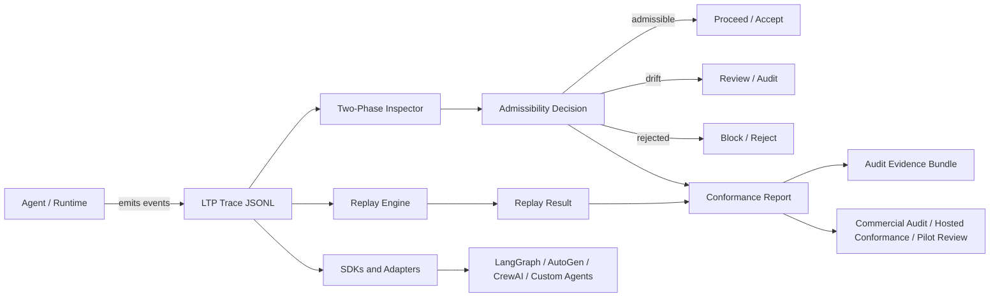

# LTP Architecture

LTP is a deterministic oversight and replay protocol for agent traces. Its architecture is organized around one core question:

> Can an agent execution path be inspected, replayed, and accepted or rejected with evidence?

## Architecture at a glance

## Core flow

1. **Agent or runtime emits events**  
   A model, agent framework, tool executor, or custom runtime produces execution events.

2. **Events become an LTP trace**  
   The trace preserves an ordered execution path, usually as JSONL, with enough structure to inspect state transitions and evidence assumptions.

3. **Replay engine checks determinism**  
   Replay verifies whether the path can be reconstructed or validated against expected behavior.

4. **Two-phase inspector checks admissibility**  
   The inspector evaluates whether claims/actions are grounded before and after generation or action.

5. **Decision is produced**  
   The execution path is classified as:

   - `admissible` — grounded and policy-safe enough to proceed.
   - `drift` — review is needed because the path degraded or deviated.
   - `rejected` — unsupported claims/actions or missing anchors make the path inadmissible.

6. **Evidence is exported**  
   Logs, conformance reports, replay outputs, and audit summaries become reviewable artifacts.

## Main components

| Component | Responsibility |
|---|---|
| Agent/runtime | Produces tool calls, model outputs, state transitions, or execution events. |
| LTP trace | Structured record of the execution path. |
| Replay engine | Reconstructs or validates the trace behavior. |
| Two-phase inspector | Checks pre-action/pre-generation and post-action/post-generation admissibility. |
| Anchors | Evidence/state references supporting claims or actions. |
| Conformance fixtures | Stable examples used to validate implementations. |
| SDKs/adapters | Integration surface for external runtimes and frameworks. |
| Reports | Human/machine-readable evidence output. |
| Commercial/audit layer | Pilot review, hosted conformance, audit report, dashboards, and integration support. |

## Extension points

New contributors can usually work safely in these areas:

- SDK examples.
- Adapter documentation.
- Conformance fixture documentation.
- Replay visualization.
- Audit report templates.
- CI validation.
- Quickstart and onboarding docs.

Changes that require deeper review:

- Trace schema semantics.
- Cryptographic assumptions.
- Decision codes.
- Inspector invariants.
- Golden fixture behavior.
- Claims about certification or compliance.

## What LTP is not

LTP is not an agent orchestrator, model router, vector database, or replacement for app logs. It is an evidence and oversight layer for execution paths that need replay, inspection, and admissibility decisions.

## Commercial architecture boundary

The protocol should remain open and inspectable. Commercial value should come from:

- integration support,
- hosted conformance validation,
- audit reviews,
- evidence dashboards,
- enterprise adapters,
- certification-readiness workflows.

The commercial layer should not be required to use or understand the open protocol.
