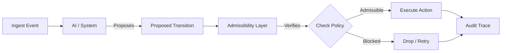

# LTP for Content & Streaming

## Infrastructure for Safe Live Content

LTP (Liminal Thread Protocol) provides a standardized architecture for content platforms to enforce safety, policy, and auditability **before** content is delivered to the audience.

Unlike traditional moderation which reacts to reports (ban after the fact), LTP operates as a **pre-flight check** for every significant state change in a stream, whether it's an AI co-host speaking, an overlay appearing, or an ad insertion.

### The Content Pipeline

In the LTP model, content delivery is not a direct pipe. It is a series of proposed transitions.



#### 1. ContentEvent (The Trigger)
Events are ingested into the system state (via `heartbeat` frames).
*   Chat message received
*   Voice chunk transcribed
*   Game event (kill, win, loss)
*   Ad slot available

#### 2. ProposedTransition (The Request)
The system (or AI Agent) proposes a response. It does **not** execute it yet.
*   *AI proposes:* "Say <joke>"
*   *Overlay system proposes:* "Show <ad_banner>"

#### 3. AdmissibilityCheck (The Guardrail)
The Admissibility Layer evaluates the proposal against active policies (ContextFrame).
*   *Is this joke toxic?*
*   *Is this ad suitable for a kids stream?*
*   *Is this overlay covering a sponsor logo?*

#### 4. AuditTrace (The Proof)
Every proposal, whether allowed or blocked, is cryptographically signed and logged. This creates an unforgeable history of "why this happened."

### Content Policies as Code

LTP allows platforms to define policies that are machine-verifiable.

**Example: Kids Mode Policy**

```yaml
policy: kids_safe_v1
rules:
  - prevent: violence_tags
    action: block_transition
  - prevent: external_links
    action: degrade_route (hide_link)
  - require: educational_tag
    action: boost_priority
```

When a transition is blocked, the `route_response` frame includes the specific policy violation:

```json
{
  "status": "blocked",
  "reason": "policy_violation:kids_mode_strict",
  "details": "Content tags 'blood' not allowed in profile 'under_13'"
}
```

### Incident Replay

Because LTP records the full state and decision tree (not just the output), platforms can "replay" incidents to understand root causes.

**Scenario:** A streamer claims they were banned unfairly for a "joke".

**Traditional Logs:**
> User: [Deleted]
> ModAction: Ban (Hate Speech)

**LTP Trace:**
1.  **State:** Stream context = "Politics Discussion"
2.  **Event:** User message
3.  **Proposal:** AI Mod proposes "Timeout User"
4.  **Admissibility:** ALLOWED (Confidence 0.98, Rule: "Zero Tolerance Keyword detected")
5.  **Action:** Timeout Executed

This allows Support teams to see *exactly* why the system acted, or why an AI co-host was silenced.
