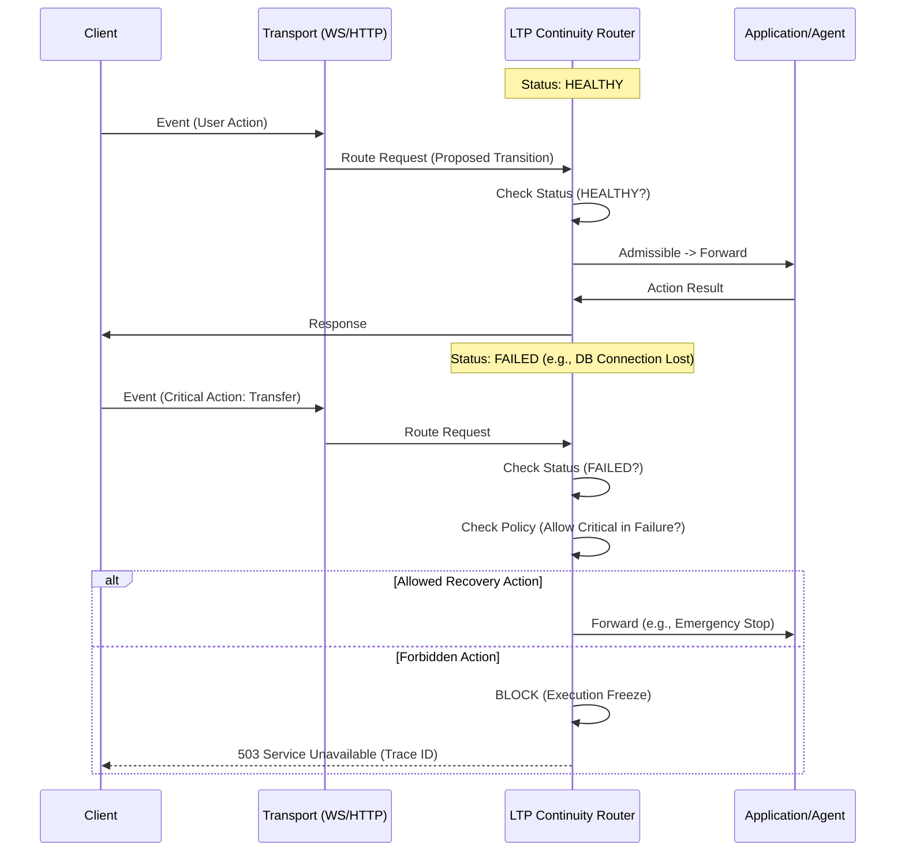

# Continuity Router Flow

This diagram illustrates the decision flow within the LTP Continuity Router.

## Key States

1.  **Forward:** Standard operation. The router passes the transition to the agent/application.
2.  **Freeze:** The router explicitly blocks the transition because the system orientation does not support it (e.g., trying to write to a DB that is known down).
3.  **Trace:** Every decision—forward or freeze—is logged in the LTP trace for immutable auditability.
